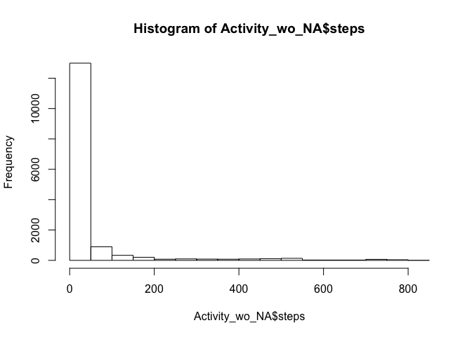

```r
knitr::opts_chunk$set(echo = TRUE)

#Load all packages 
library(knitr)
library(dplyr)
```

```
## 
## Attaching package: 'dplyr'
```

```
## The following objects are masked from 'package:stats':
## 
##     filter, lag
```

```
## The following objects are masked from 'package:base':
## 
##     intersect, setdiff, setequal, union
```

```r
library(ggplot2)

#Load data
fileURL= "https://d396qusza40orc.cloudfront.net/repdata%2Fdata%2Factivity.zip"
activityFile="activity.zip"
download.file(url=fileURL,destfile=activityFile)
unzip(activityFile)
activity_row =read.csv("activity.csv")

#Process data
activity = activity_row[with(activity_row,{!(is.na(steps))}),]
```

What is mean total number of steps taken per day?

```r
by_day =group_by(activity,date)
steps_by_day = summarise(by_day,total=sum(steps))
head(steps_by_day)
```

```
## # A tibble: 6 x 2
##   date       total
##   <fct>      <int>
## 1 2012-10-02   126
## 2 2012-10-03 11352
## 3 2012-10-04 12116
## 4 2012-10-05 13294
## 5 2012-10-06 15420
## 6 2012-10-07 11015
```

```r
hist(steps_by_day$total,main="Histogram of total number of steps taken per day", xlab = "Total no. of steps in a day")
```

<!-- -->

```r
summary(steps_by_day)
```

```
##          date        total      
##  2012-10-02: 1   Min.   :   41  
##  2012-10-03: 1   1st Qu.: 8841  
##  2012-10-04: 1   Median :10765  
##  2012-10-05: 1   Mean   :10766  
##  2012-10-06: 1   3rd Qu.:13294  
##  2012-10-07: 1   Max.   :21194  
##  (Other)   :47
```

What is the average daily activity pattern?

```r
steps_by_interval = aggregate(steps~interval,activity,mean)
plot(steps_by_interval$interval,steps_by_interval$steps,type='l',main="Average number of steps over all days", xlab="Interval", ylab="Average number of steps")
```

<!-- -->

```r
max_steps_row <- which.max(steps_by_interval$steps)
steps_by_interval[max_steps_row, ]
```

```
##     interval    steps
## 104      835 206.1698
```


Inputing missing values
Calculate and report the total number of missing values in the dataset

```r
sum(is.na(activity_row))
```

```
## [1] 2304
```

Filling in all of the missing values in dataset

```r
activity_imputed=activity_row
for(i in 1:nrow(activity_imputed)){
  if(is.na(activity_imputed$steps[i])){
    interval_value=activity_imputed$interval[i]
    steps_value=steps_by_interval[
      steps_by_interval$interval ==interval_value,]
    activity_imputed$steps[i]=steps_value$steps
  }
}
```
Histogram of the total no. of steps taken each day 

```r
df_imputed_steps_by_day = aggregate(steps~date,activity_imputed,sum)
hist(df_imputed_steps_by_day$steps,main="Histogram of total no. of steps per day(Imputed)",
     xlab = "Total no. of steps in a day")
```

<!-- -->

```r
mean(df_imputed_steps_by_day$steps)
```

```
## [1] 10766.19
```

```r
median(df_imputed_steps_by_day$steps)
```

```
## [1] 10766.19
```

```r
mean(steps_by_day$total)
```

```
## [1] 10766.19
```

```r
median(steps_by_day$total)
```

```
## [1] 10765
```
Mean values stay the same but a slight difference in the median value

Are there differences in activity patterns between weekdays and weekends?

```r
activity_imputed['type_of_day']= weekdays(as.Date(activity_imputed$date))
activity_imputed$type_of_day[activity_imputed$type_of_day  %in% c('Saturday','Sunday') ] <- "weekend"
activity_imputed$type_of_day[activity_imputed$type_of_day != "weekend"]="weekday"
activity_imputed$type_of_day = as.factor(activity_imputed$type_of_day)
df_imputed_steps_by_interval= aggregate(steps~interval+type_of_day,activity_imputed,mean)
qplot(interval,steps,data=df_imputed_steps_by_interval,type='l',
geom=c('line'),xlab="Interval",ylab="Number of steps",
main="")+
facet_wrap(~type_of_day,ncol=1)
```

```
## Warning: Ignoring unknown parameters: type
```

<!-- -->


