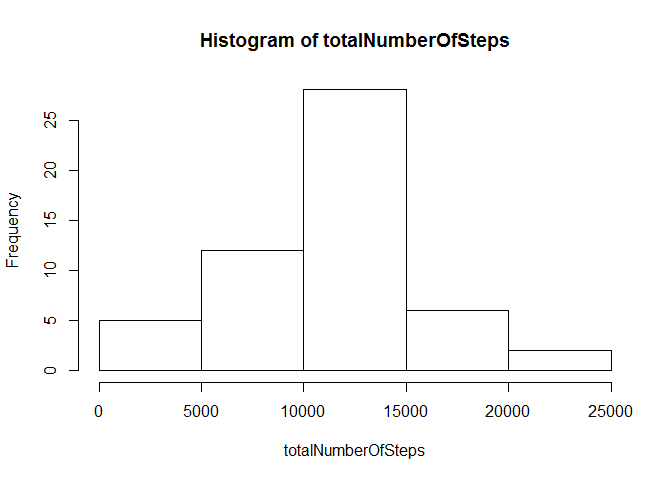

# Reproducible Research: Peer Assessment 1


## Loading and preprocessing the data

The dataset is [Activity monitoring data](https://d396qusza40orc.cloudfront.net/repdata%2Fdata%2Factivity.zip). Download the data file, unzip it and put it into your working directory. Loading the data using the following R code:


```r
D<- read.csv("D:/COURSERA_Reproducible_Research/Assignment1/repdata-data-activity/activity.csv")
head(D)
```

```
##   steps       date interval
## 1    NA 2012-10-01        0
## 2    NA 2012-10-01        5
## 3    NA 2012-10-01       10
## 4    NA 2012-10-01       15
## 5    NA 2012-10-01       20
## 6    NA 2012-10-01       25
```
For the following problems, we ignore the missing values in the dataset as:

```r
Data <- D[!is.na(D[,1]),]

head(Data)
```

```
##     steps       date interval
## 289     0 2012-10-02        0
## 290     0 2012-10-02        5
## 291     0 2012-10-02       10
## 292     0 2012-10-02       15
## 293     0 2012-10-02       20
## 294     0 2012-10-02       25
```

## What is mean total number of steps taken per day?
For this part, we ignore the missing values in the dataset. The total number of steps taken per day could be performed via:

```r
datesSet <- union(Data[,2],Data[,2])
totalNumberOfSteps=1:length(datesSet)

for (index in 1: length(datesSet))
{
	subData <- Data[Data[,2]==datesSet[index],]
	totalNumberOfSteps[index] <- sum(subData[,1])
}

totalNumberOfSteps
```

```
##  [1]   126 11352 12116 13294 15420 11015 12811  9900 10304 17382 12426
## [12] 15098 10139 15084 13452 10056 11829 10395  8821 13460  8918  8355
## [23]  2492  6778 10119 11458  5018  9819 15414 10600 10571 10439  8334
## [34] 12883  3219 12608 10765  7336    41  5441 14339 15110  8841  4472
## [45] 12787 20427 21194 14478 11834 11162 13646 10183  7047
```

The histogram of the total number of steps taken each day is:

```r
hist(totalNumberOfSteps)
```

 

The mean and median of the total number of steps could be obtained by:

```r
summary(totalNumberOfSteps)
```

```
##    Min. 1st Qu.  Median    Mean 3rd Qu.    Max. 
##      41    8841   10760   10770   13290   21190
```

From above, the mean is 10770 and the median is 10760.

## What is the average daily activity pattern?


## Imputing missing values


## Are there differences in activity patterns between weekdays and weekends?


